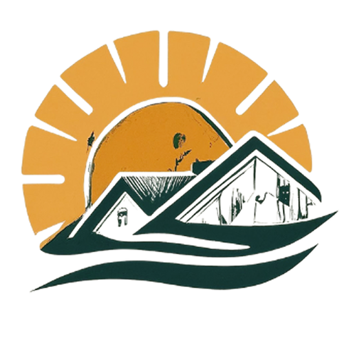

  

# Herdades do Sol

**Herdades do Sol** is a digital platform designed to promote and manage rural estates, combining the **sale of regional products**, **accommodation bookings**, and **tourist activities** into a single application.

The solution provides an intuitive experience for users, allowing them to explore estates, make purchases, and book reservations online in a secure way, while also offering a **complete administrative panel** for managing estates, products, activities, users, and business metrics.

Developed with **Laravel**, **Blade**, and **Livewire**, the project follows the MVC architecture and was designed to be **scalable, secure, and easily extensible**, adapting to the needs of modern rural tourism and digital commerce.

---

## Main Features

### User
- User registration and authentication with email confirmation
- Exploration of estates, products, and activities
- Shopping cart and reservation system
- Online payments (PayPal and card)
- Account management, purchase history, and reservations

### Administration
- Management of estates, users, products, and categories
- Management of accommodations and tourist activities
- Inventory control
- Visualization of sales and reservation reports and metrics
- System prepared for future expansions (reviews, invoicing, advanced filters)

---

## Technologies Used

- **Backend:** Laravel (PHP)
- **Frontend:** Blade, Livewire, Alpine.js
- **Styling:** Tailwind CSS, Bootstrap
- **Database:** MySQL
- **Authentication:** Laravel Sanctum
- **Payments:** PayPal
- **Charts & Metrics:** Chart.js
- **Version Control:** Git & GitHub
- **UI/UX:** Figma

